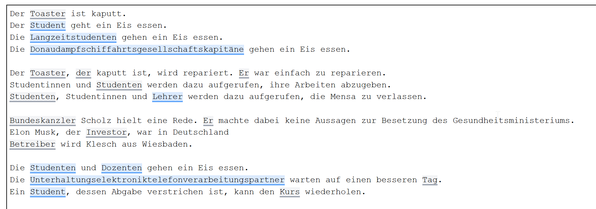
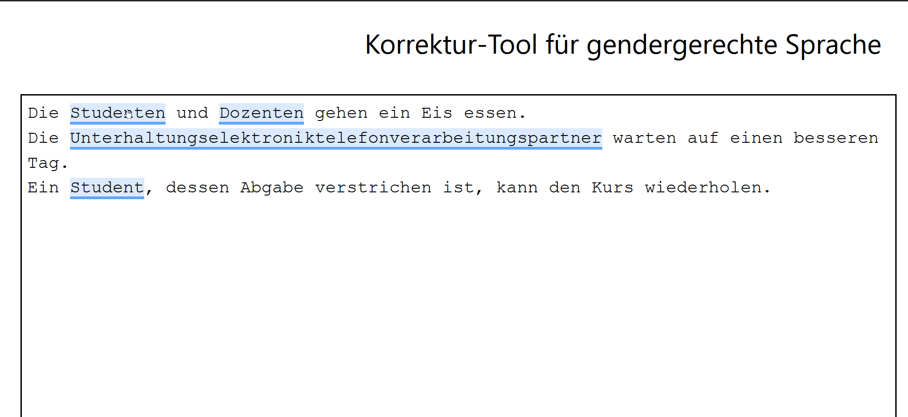

# Gender-Assistenz

Die hier liegende Anwendung entstand im Rahmen der Abschlussarbeit *Computerlinguistische Unterstützung des gendergerechten Schreibens* im Rahmen des Studiengangs *B.Sc. Informatik* an der Fernuniversität in Hagen. 
Die Arbeit wurde betreut von [Dr. Niels Seidel](https://www.fernuni-hagen.de/ks/team/niels.seidel.shtml) im Lehrgebiet [Kooperative Systeme](https://www.fernuni-hagen.de/ks/) der Fernuniversität.
Weiterentwickelt wurde diese Anwendung im Rahmen der Abschlussarbeit *Evaluation und methodische Weiterentwicklung eines Assistenzsystemes für das gendergerechte
Schreiben* im Rahmen des Studiengang *M.Sc. Praktische Informatik*  an der Fernuniversität in Hagen. 
Die Arbeit wurde betreut von [Dr. Niels Seidel](https://www.fernuni-hagen.de/ks/team/niels.seidel.shtml) bei CATALPA der Fernuniversität.

## Zusammenfassung der Arbeit
Diese Arbeit beschäftigt sich mit der Frage, wie gut ein System zur Unterstützung des gender gerech

## Screenshots
### Erkennnung von generischem Maskulinum

Legende:
- Grau: Keine Personenbezeichnung oder kein generisches Maskulinum.
- Blau: Personenbezeichnung + Generisches Maskulinum

### Erstellung der Korrekturvorschläge

## Installation und Start
### Voraussetzungen
 - Python 3.9+ (https://www.python.org/)
 - Poetry (https://python-poetry.org/)
 - NodeJS (https://nodejs.org/en/)

### Schritte zum Installieren & Starten

Ausgehend vom Projektverzeichnis als Working Directory:

- poetry install
- cd client
- npm install
- npm run build
- cd ..
- poetry shell / poetry env activate (je nach installierter poetry version)
- python -m spacy download de_dep_news_trf
- python -m spacy download de_core_news_lg
- (python -m pip install coreferee)*
- python -m coreferee install de
- (python -m pip install bottle)*
- (python -m pip install loguru)*
- (python -m pip install dataset)*
- python web_server.py

Die in Klammen mit Sternchen versehenen Befehle müssen eigentlich nicht ausgeführt werden, da die entsprechenden Dependencies per
Poetry heruntergeladen werden sollten. Bei einigen Tester*innen hat das jedoch nicht funktioniert. Als Workaround daher zusätzlich
eine Installation per *pip*, was zugegebenermaßen unschön ist.

### Neu starten

Ausgehend vom Projektverzeichnis als Working Directory:

- poetry shell
- python web_server.py

### Aufruf im Browser

Die gestartete Applikation kann im Browser unter der Adresse *http://localhost:8080/index.html* aufgerufen werden.

## Nutzung in LibreOffice
### Vorraussetzungen
- LibreOffice & LibreOfficeSDK (https://de.libreoffice.org/)
- Lokaler GenderAssistenz Server läuft

### Installation
LibreOffice starten Writer Dokument auswählen unter Tools -> Extensions -> Add (dann gender-assist.oxt wählen) Libre office neu starten. 
Ein Klick auf Analyse Starten analysiert den gesamten Text und geht danach die Änderungen durch.

## Überblick über die Ordnerstruktur

- /charsplit : Hier ist die Bibliothek [charsplit](https://github.com/dtuggener/CharSplit) von *Tuggener, Don* zu finden. Sie wird im Rahmen der Anwendung zum sogenannten *compound splitting* im Rahmen der Suche nach abstrahierender Verwendung (2. Schritt) und Erstellung der Korrekturvorschläge (3. Schritt) verwendet. Weitere Informationen gibt es dazu im Kapitel *2.4.2 Dynamische Erweiterung um zusammengesetzte Nomen*. 
- /client : Enthält die entwickelte Webanwendung, die im Kapitel *3. Webanwendung* beschrieben wurde.
- /pipeline : Enthält die tatsächliche Verarbeitungslogik. Also insbesondere die im gesamten Kapitel *2. Identifikation und Korrektur des generischen Maskulinums* vorgestellten Arbeitsschritte.
- /pipeline/initial_words : Enthält die Logik zum ersten Schritt: *2.1. Suche nach Pronomen und Nomen in maskuliner Form*
- /pipeline/ntbg : Enthält die Logik zum zweiten Schritt: *2.2. Überprüfung auf das generische Maskulinum*.
- /pipeline/correction : Enthält die Logik zum dritten Schritt: *2.3. Generierung von Korrekturvorschlägen*.
- /results : Enthält die Ergebnisse der Bachelor-Arbeit sowie die entsprechenden Skripte und Utilities, mit denen die Ergebnisse erstellt wurden. (vgl. *4. Evaluation*)
- /utils : Allgemeine Utiities.
- /wiktionary : Enthält die Skripte, um die im Kapitel *2.4. Erstellung eines Wörterbuchs* vorgestellte Wort-Datenbank zu erstellen. Außerdem wird eine API zum Zugriff sowie die dynamische Erweiterung um zusammengesetzte Nomen zur Verfügung gestellt.

## Weitere Anmerkungen

Bei der Anwendung handelt es sich ein Projekt, welches unter den Zeitbegrenzungen einer Bachelor-Arbeit der Fernuniversität Hagen, entwickelt wurde und unter den Bedingungen einer Masterarbeit weiterentwicklet wurde. Insofern darf man an die Qualität 
des erstellten Programmcodes nicht zu hohe Anforderungen haben. Wesentlich sind die vorgestellten Ideen und Vorgehensweisen. Nichtsdestotrotz sollen im Folgenden einige Gedanken
des Autors einmal aufgelistet werden, die den Programmcode deutlich verbessern sollten:

- **Coreferee + X** : Die verwendete Bibliothek zur Koreferenz-Auflösung [coreferee](https://github.com/msg-systems/coreferee) hat einige Limitationen, die im entsprechenden GitHub-Repository beschrieben werden. Insbesondere werden solche Koreferenzen, die eindeutig aus der Grammatik des Satzes ermittelbar sind, nicht erfasst. Diese Koreferenzen werden aber dennoch benötigt. Im aktuellen Stand der Anwendung werden diese grammatischen Regeln zusätzlich im Rahmen des Schrittes 2 und Schrittes 3 ausgeführt. Dabei erfolgt keine richtige Trennung zwischen den Funktionalitäten *Koreferenz-Auflösung* und *Erkennung von Personenbezeichnungen* bzw. *Koreferenz-Auflösung* und *Erstellung von Korrekturvorschlägen*. Es wäre besser die Koreferenz-Auflösung von Anfang an um die grammatischen Regeln zu erweitern und mit diesen Ergebnissen in späteren Schritten zu arbeiten.
- **Trennung: Erkennung von Personenbezeichnungen und abstrahierender Verwendung** : Ob eine Personenbezeichnung und / oder eine abstrahierende Verwendung vorliegt wird im Moment stark verzahnt geprüft. Es wäre sinnvoll, diese Aufgaben als Teilprobleme aufzufassen und entsprechend zu abstrahieren.
- **Wortdatenbank** : Der Code für den Zugriff auf die Wortdatenbank ist ziemlich verstreut. Es wäre sinnvoll, diese in eine eigene Ordnerstruktur zu legen. Gegebenenfalls wäre es sinnvoll, diese in ein eigenes Teilmodul zu übertragen. Diese Funktionalität, insbesondere im Hinblick auf die dynamische Erweiterung um zusammengesetzte Nomen, könnte auch in anderen Projekten anwendbar sein.
- **Extrahierung aus dem Wiktionary**: Der hier erstellte Code ist sehr unübersichtlich. Statt mit regulären Ausdrücken und Zeichenkettenoperationen zu arbeiten, wäre es sinnvoll, einen Wiktionary-Parser zu verwenden. In Betracht kommen beispielsweise [wiktextract](https://github.com/tatuylonen/wiktextract) und [dkpro-jwktl](https://github.com/dkpro/dkpro-jwktl). Diese Tools wurden im Rahmen der Ausarbeitung ausprobiert, konnten jedoch nicht in der Kürze der Zeit zum Laufen gebracht werden. Zum Teil müssen sie auch um die Unterstützung der Flexionsseiten (Bsp.: [https://de.wiktionary.org/wiki/Flexion:gehen](https://de.wiktionary.org/wiki/Flexion:gehen)) erweitert werden.
- **CharSplit**: Die Bibliothek für das *compound splitting*, [CharSplit](https://github.com/dtuggener/CharSplit) ist selbst nicht im PyPI vorhanden. Hier wurde die Bibliothek einfach als Code eingebunden. Sinnvoll wäre es, die Bibliothek auszulagern und ggf. mit Einverständnis des Autors im PyPI zu veröffentlichen. Außerdem hat die Bibliothek Probleme Wörter Korrektur zu trennen die auf gültige Silben enden wie Alten (Inhalten, Vorbehalte etc.)
- **Probleme mit Leerzeichen**: Der Client macht Probleme, wenn ein Wort durch Leerzeichen ersetzt wird. Beispielsweise wenn der Artikel *Ein* korrekterweise in einen Leerstring korrigiert wird (*Ein Student geht.* -> *Studenten gehen.*). Das ist zu korrigieren.
- **Generierung von Korrekturvorschlägen**: Das aktuelle Vorgehen zur Erstellung der Korrekturvorschläge und der dazugehörige Code ist zurzeit Kraut und Rüben. Dieser könnte durch die Implementierung von *Coreferee + X* deutlich einfacher werden.
- **LibreOffice Plugin**: das Plugin liegt aktuell lediglich in Form eine proof of concept vor und müsste an die Anforderungen für produktive Software angepasst werden.
- **GenderRegeln*: es wäre sinnvoll die Regeln ob ein Begriff gegendert werden muss oder nicht in eine zentrale Rule-Engine auszulagern so das diese einzeln testbar und manuell wartbar werden würden.
#
